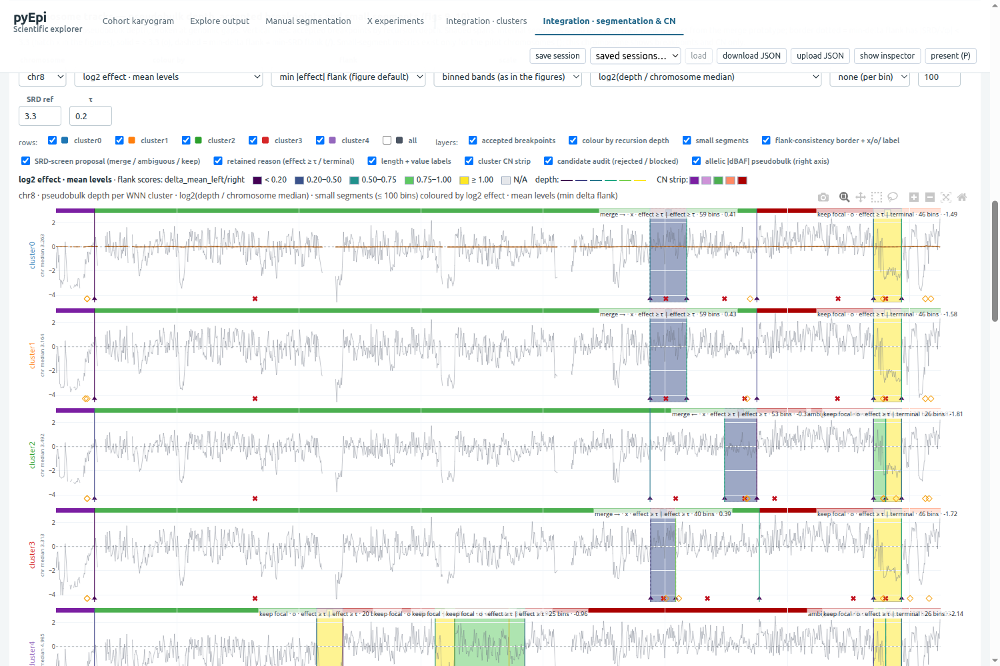
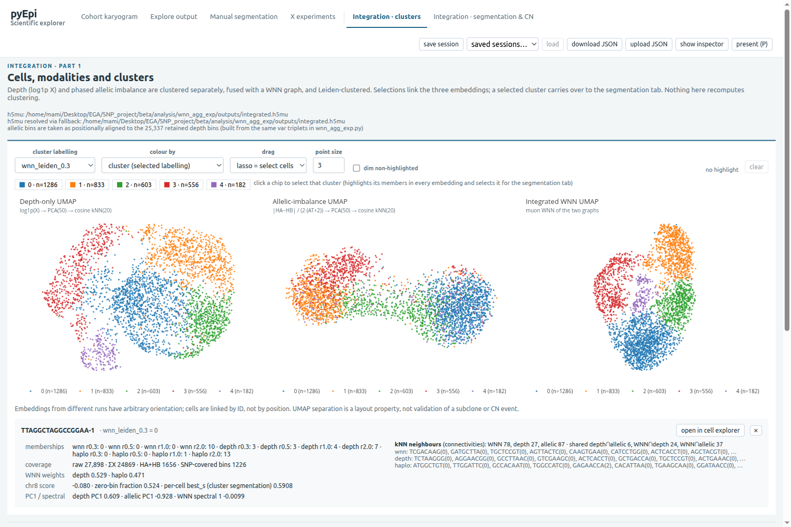
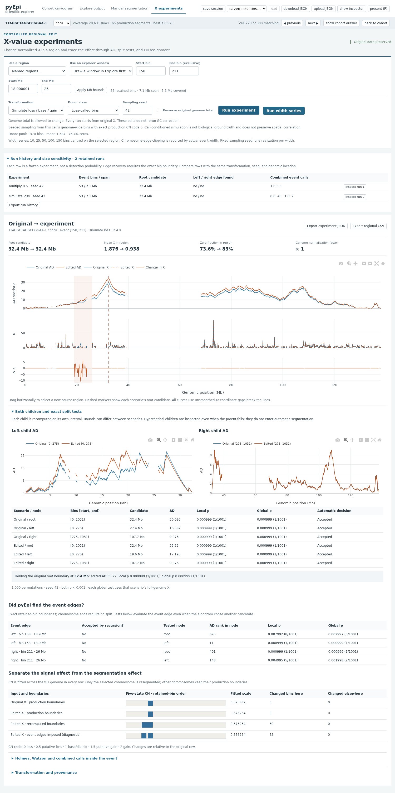
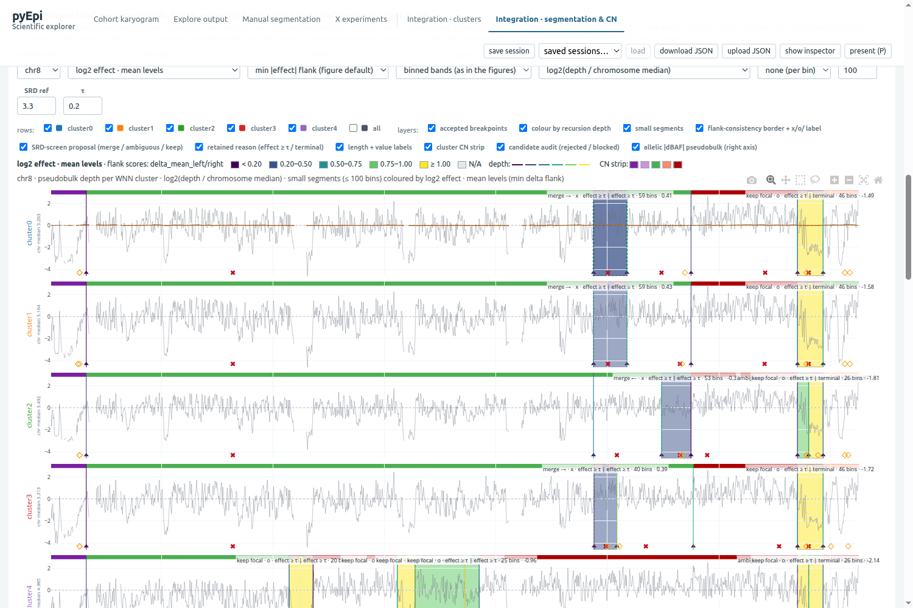

# Scientific Explorer

An interactive research workbench for investigating copy-number
segmentation failure modes, counterfactual perturbations, and multimodal
pseudobulk analysis in pyEpiAneufinder.

|  |  |
|---|---|
|  |  |
| Chromosome tracks with exploratory hatch classification | Multimodal WNN/depth/allelic clustering |
|  |  |
| Counterfactual region-edit experiment | Segment-level flank inspection |

## Why this exists

I built this to investigate *why* pyEpiAneufinder's recursive breakpoint
segmentation succeeds or fails on specific cells and chromosomes, rather
than guessing from its outputs alone. Instead of only reading the accepted
copy-number calls, this tool lets me perturb the input directly — edit
regions, simulate loss/base/gain states from a cell's own data, run width
series, merge candidate boundaries under alternative eligibility rules — and
watch the algorithm's decisions change in response. That's the fastest way
I've found to tell whether an observed behavior is a real property of the
method or an artifact of one dataset.

## Research-led, AI-assisted engineering

This repository is the interactive workbench I built while investigating
failure modes and alternative strategies in pyEpiAneufinder segmentation.
The interface is the visible layer of a longer method-development process
involving coverage-stratified analyses, bootstrapping, breakpoint
perturbations, alternative scoring/statistical tests, cluster-level
analyses, and pseudobulk segmentation.

AI/agents may assist with implementation, refactoring, testing, and
interface work, while the scientific questions, hypotheses, experimental
design, interpretation, and validation remain researcher-directed.

## How I use this repository

```text
Observed behaviour → Hypothesis → Diagnostic/counterfactual experiment →
Recompute AD/segmentation/CN → Inspect consequences →
Accept/reject/refine hypothesis → Modify method or move to another analysis level
```

See [docs/SCIENTIFIC_WORKFLOW.md](docs/SCIENTIFIC_WORKFLOW.md) for two
worked examples of this loop in this repository.

## What the explorer can do

- **Cohort karyogram** — the real 300-cell categorical matrix, coverage/event filters, cell and chromosome navigation.
- **Explore output** — independently computed parent/child AD, X and log2FC tracks, interactive windows, AD/X statistics and autocorrelation.
- **Manual segmentation** — user-selected boundaries, exact tests, undo/redo, full-genome CN fitting, and alternative (arithmetic/IQR) segment estimators.
- **X experiments** — original-vs-edited data, empirical state simulations, region extension/duplication, width series, event-edge tests, four CN comparisons.
- **Integration · clusters** — multimodal WNN/depth/allelic UMAPs with linked selection and per-cell inspection.
- **Integration · segmentation & CN** — cluster-level and per-cell karyograms, configurable chromosome tracks, an on-demand alternative flank view and paired-cell bootstrap, and the exploratory hatch-layer/adjacent-segment merge tool.

See [docs/USAGE.md](docs/USAGE.md) for the full operational detail.

## Example research questions

- Does a simulated copy-number event of a given width and dispersion actually get recovered as an accepted breakpoint, and at what width does detection degrade?
- Do two adjacent small segments in a cluster's pseudobulk segmentation represent a genuine boundary, or an artifact of weak/ambiguous flank support?
- How does an alternative segment-mean estimator (upper-tail IQR vs. arithmetic) change downstream CN calls, and where do the two disagree?
- Is a candidate merge proposal's flank score consistent across SRD, SRD/√φ, and delta-log2FC, or does the choice of metric change the conclusion?

## Scientific scope and limitations

Simulation samples from a cell's own genome-wide bins under a matching
production call — it is a call-conditioned exploratory model, not an
independently validated biological CN simulator. SRD/√φ is a
dispersion-scaled deviance statistic, not a p-value. The exploratory
hatch-merge tool is an independent rule, not the original bootstrap/
chain-guard merge prototype, and does not recompute CN calls on merged
boundaries. See [docs/VALIDATION.md](docs/VALIDATION.md) and
[docs/USAGE.md](docs/USAGE.md) for the full statement of scope.

## Architecture

```text
server/     FastAPI backend — API routes, scientific adapters, experiments
web/        React/TypeScript/Vite frontend
tests/      Unit, parity, and browser workflow tests
validation/ Test evidence and screenshots
reference/  Archival, verified-reproducible prior-research tables
docs/       Documentation (this index: docs/README.md)
```

See [docs/ARCHITECTURE.md](docs/ARCHITECTURE.md) for the full module map and
a data-flow diagram.

## Quick start

```bash
cd scientific-explorer
python3 -m pip install -r requirements.txt
python3 run.py
```

Open **http://127.0.0.1:8766**. The built frontend is included locally. Optional launcher arguments:

```bash
python3 run.py --port 9001 --data-root /path/to/workspace
```

The data root contains `pyepi_results/`, `default_300cells/` and `pyEpiAneufinder/`. By default it is this application's parent directory. No data are copied or edited by an experiment. `cache/` and `sessions/` belong only to this application.

Overrides use the **PYEPI_SCIENTIFIC_** prefix: `ROOT`, `COHORT`, `H5AD`, `PACKAGE`, `CACHE`, `SESSIONS`, `PORT`, `HOST`. The Fable app uses a different prefix and default port.

### Rebuild the interface

```bash
cd web
npm ci
npm run build
```

For frontend development, `npm run dev` serves port 5174 and proxies API requests to 8766. Run the Python service separately. Python >=3.10 and Node >=18 are required by the inherited stack.

### Tests

```bash
python3 -m pytest -q tests/test_hatch_merge.py tests/test_experiments.py tests/test_segment_estimators.py tests/test_integration_review.py
```

See [tests/README.md](tests/README.md) for the full test suite, browser-test prerequisites, and parity checks.

## Validation

Every feature ships with a companion verification pass — automated tests,
browser walkthroughs, and byte-for-byte reproduction checks against archived
reference outputs. See [docs/VALIDATION.md](docs/VALIDATION.md).

## Extending the explorer

Adding a new diagnostic, experiment, or scoring method follows a repeatable
workflow — define the question, identify what layer it touches, reuse
existing scientific functions, add tests and validation evidence. See
[docs/EXTENDING.md](docs/EXTENDING.md) and [AGENTS.md](AGENTS.md).

## Contributing

Bug reports, scientific/algorithmic issues, new diagnostics, and
documentation are all welcome. See [CONTRIBUTING.md](CONTRIBUTING.md) for
the PR checklist, which asks contributors to state what category of change
(visualization / data transformation / statistical score / significance
testing / segmentation / CN assignment) their change affects.

## License

[MIT](LICENSE), covering this repository's own code. `pyEpiAneufinder` is an
external runtime dependency, not vendored into this repository — see
[docs/LICENSING.md](docs/LICENSING.md) for the full audit.

---

Integration tabs (multimodal clustering and pseudobulk segmentation): two
read-only tabs load the exported artifacts of the depth + haplotype
integration story (`../integration-story/`); nothing is re-clustered,
re-integrated or re-segmented.

| Input | Default location | Override |
|---|---|---|
| `integrated.h5mu` (cells, labels at four Leiden resolutions, WNN weights, UMAPs, PCA, graphs, allelic abs-dBAF) | `integration-story/data/integrated.h5mu`, else the path recorded in `data/prototype/run_manifest.json` | `PYEPI_SCIENTIFIC_H5MU` |
| pseudobulk breakpoints (`raw_accepted_breakpoints.tsv`) | `integration-story/data/` | `PYEPI_SCIENTIFIC_CLUSTER_BREAKPOINTS` |
| derived cluster segments / per-cell CN (`data/derived/`) | `integration-story/data/derived` | `PYEPI_SCIENTIFIC_DERIVED` |
| merge-prototype and SRD-screen tables (`data/prototype/`) | `integration-story/data/prototype`, else the verified `scientific-explorer/reference/integration-prototype/regenerated` | `PYEPI_SCIENTIFIC_PROTOTYPE` |
| whole story directory | `<root>/integration-story` | `PYEPI_SCIENTIFIC_INTEGRATION` |

The explorer's own `count_matrix.h5ad` X (not the log1p copy inside the h5mu) is used for the per-cluster pseudobulk profiles and the per-cell chr8 score. At first start a background index (one pass over X, allelic pseudobulk, WNN diffusion component, per-cell CN as uint8) takes ~6 s and is cached under `cache/integration_<hash>.npz`; `/api/integration/status` reports it.

API: `/api/integration/{status,meta,pseudobulk.bin,percell_karyogram.bin,cell/{id},candidates}`.

### Hatching and merge routes

`POST /api/integration/hatch-scores` `{chrom, source}` returns per-internal-segment SRD, SRD/√φ and delta-log2FC (mean/median/two-sided-IQR-mean) scores against both flanks, plus the chromosome's pooled φ and per-side genomic-gap flags, computed live from `server/hatch_merge.py` — genome-wide, not limited to the archived pilot chromosomes.

`POST /api/integration/hatch-merge` `{chrom, source, transition?, proposal?, ambiguous?, small_max_bins?, allow_gap_crossing?}` runs the new exploratory greedy merge. Eligibility is the union of whichever of the three layers is present (at least one is required): `transition` and `ambiguous` each carry `{metric, estimator}` and fire when either adjacent segment is itself so classified; `proposal` carries `{metric, estimator, threshold}` and fires on a direct threshold comparison between the two flanks. Each layer reuses the same metric/estimator/threshold already visible in the Chromosome tracks hatch controls of the same name — there is no separate metric configuration in the merge tool itself. Pooled dispersion φ is recomputed every iteration; one boundary merges per step, ranked by the smallest proposal `|score|` when available, else leftmost. The response returns the full step history (original → final), so the frontend can undo/reset/inspect any intermediate step purely by indexing into the response — no server-side session state. See `server/hatch_merge.py` for the numerical rules and `tests/test_hatch_merge.py` for their test coverage.

See [the multimodal design handoff](../HANDOFF_FOR_MULTIMODAL_DESIGN_AGENT.md) for the next design phase's architecture, proposed visualization workspaces, scientific constraints, data contracts and setup lessons.
