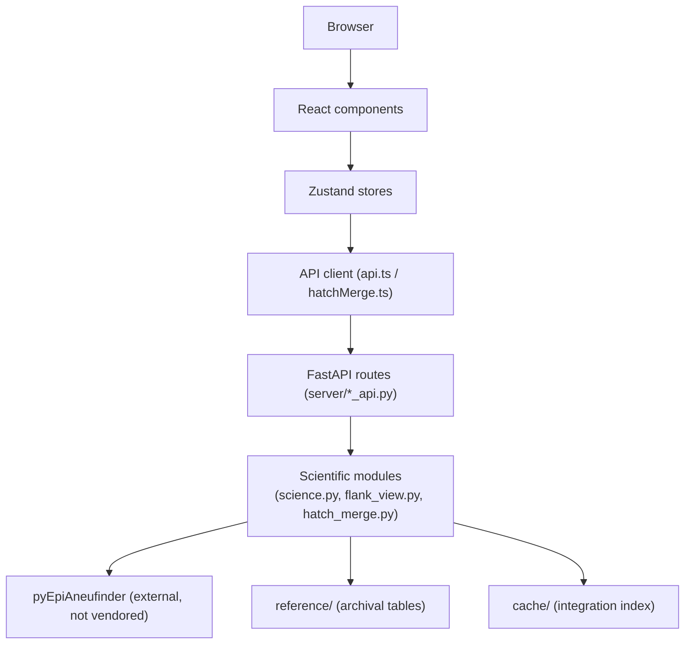

# Architecture

A FastAPI backend (`server/`) serves both a JSON API and the built React
frontend (`web/dist/`). The React/TypeScript/Vite frontend (`web/src/`) uses
Zustand for state and Plotly for genomic tracks and plots. `reference/` holds
archival, verified-reproducible prior-research tables; `validation/` holds
test evidence and screenshots.

## Backend (`server/`)

| Module | Responsibility |
|---|---|
| `run.py` (repo root) | Entry point: CLI args, env var resolution, launches the FastAPI app. |
| `server/app.py` | Assembles the FastAPI app and registers every route module. **Route registration order matters**: API routes must be registered before the SPA static-file catch-all, or they silently receive HTML instead of JSON. |
| `server/config.py` / `server/data.py` | Resolves the data root and its overrides (`PYEPI_SCIENTIFIC_*` env vars), loads the cohort. |
| `server/science.py` / `server/pyepi_adapter.py` | The adapter around the external `pyEpiAneufinder` package — see [LICENSING.md](LICENSING.md). Registers the package directory without executing its `__init__.py` (which eagerly imports plotting/postprocessing modules) and imports the scientific modules directly. Every statistic here is a direct, unmodified call into `pyEpiAneufinder`. |
| `server/experiments.py` / `server/experiment_api.py` | X experiments: region edits (multiply/add/replace/simulate/extend/duplicate), width series, event-edge diagnostics, recursion-depth inspection (k = 1–10), the four CN comparison rows. |
| `server/segment_estimators.py` | Manual segmentation's alternative segment-mean estimators (arithmetic, upper-tail IQR, two-sided IQR). |
| `server/integration.py` / `server/integration_api.py` | Multimodal clustering/pseudobulk data adapter for the Integration tabs — loads the depth + haplotype integration story's exported artifacts read-only (nothing is re-clustered, re-integrated, or re-segmented here), with background indexing/caching under `cache/`. |
| `server/flank_view.py` | The on-demand "alternative flank view" and paired-cell bootstrap: descriptive flank-comparison recomputation independent of the archived SRD-screen tables. |
| `server/hatch_merge.py` / `server/hatch_merge_api.py` | The exploratory hatch-layer scoring and adjacent-segment merge module. Independent of, and does not modify, `flank_view.py` or the archived merge prototype under `reference/integration-prototype/`. Union-of-enabled-layers eligibility; pooled dispersion φ recomputed every merge iteration; see [SCIENTIFIC_WORKFLOW.md](SCIENTIFIC_WORKFLOW.md)'s worked example 2. |
| `server/jobs.py` | Bounded worker-process pool for expensive computation. Workers use multiprocessing `spawn` — worker functions must be importable/picklable at module level, not defined as closures. |

## Frontend (`web/src/`)

| Module | Responsibility |
|---|---|
| `store.ts` | Main cohort/cell/experiment state; session serialize/restore. |
| `integrationStore.ts` | Integration/multimodal state — hatch-layer settings persistence, candidate/score caching, cluster selection. |
| `experimentStore.ts` | Per-cell/chromosome experiment drafts and run history. |
| `integration.ts` | Pure helpers: consistency classes, flank picking, hatch-shape rendering geometry. |
| `hatchMerge.ts` | Types, API client, and a 1:1 TypeScript port of `server/hatch_merge.py`'s classification rules — kept in sync deliberately so a threshold change reclassifies client-side without a network round trip. |
| `api.ts` | Fetch wrapper. |
| `components/` | Major workspaces: `CohortView`, `ExplorerView`, `ManualView`, `ExperimentView`, `IntegrationClustersView`, `IntegrationSegmentationView`, `HatchMergeView`, `AlternativeFlankView`, `PairedFlankBootstrap`, plus shared `Plot`/`DeferredPlot` Plotly wrappers. `DeferredPlot` exists specifically to defer initializing off-screen charts until scrolled into view — see [`validation/integration-freeze/REPORT.md`](../validation/integration-freeze/REPORT.md) for the responsiveness investigation that motivated it. |

## Data flow: one representative request

Browser action (e.g. clicking "Run merge") → a Zustand store action reads the
relevant settings → `hatchMerge.ts`'s `runHatchMerge()` posts to
`/api/integration/hatch-merge` → `server/hatch_merge_api.py`'s route resolves
the current integration profile and validates the request → `server/hatch_merge.py`'s
pure `run_merge()` computes the full step history → JSON response → the store
updates → `HatchMergeView.tsx` re-renders the step history and plots.

## Tests and validation

`tests/` holds unit/parity tests (pytest), a Python/TypeScript numerical
parity check, and Playwright browser workflow tests. `validation/` holds the
evidence and reports those tests produce. See
[`tests/README.md`](../tests/README.md) and
[`validation/README.md`](../validation/README.md) for detail, and
[VALIDATION.md](VALIDATION.md) for the portfolio-level summary.
